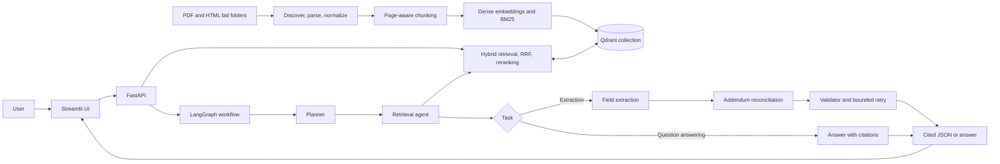
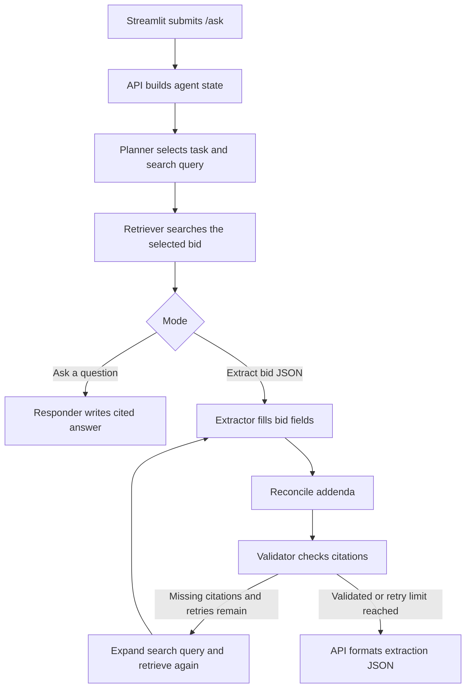

# RFP Intelligence Platform

A retrieval-augmented generation (RAG) application for searching, asking questions about, and extracting structured information from bid/RFP folders. It ingests PDF and HTML bid documents, indexes cited passages in Qdrant, and uses a LangGraph workflow with a Groq-hosted language model to answer questions and produce bid records.

## Capabilities

- Recursively discovers PDF, HTML, and HTM documents under `DATA/<bid_id>/`.
- Extracts PDF page text and tables with `pdfplumber`; parses HTML text and tables with BeautifulSoup.
- Normalizes text, removes repeated page-edge lines where detected, and creates paragraph-aware chunks.
- Indexes dense vectors and BM25 sparse vectors in Qdrant, with metadata for bid, source file, document type, page, and addendum number.
- Runs hybrid dense/sparse search with Reciprocal Rank Fusion (RRF), then reranks results with a local cross-encoder.
- Returns source file/page citations from search and Q&A.
- Extracts the assignment's 20 bid fields into JSON, including sources, confidence, notes, addendum changes, and validation counts.
- Traces API and agent work with LangSmith when tracing is enabled.

## Architecture



## Project layout

```text
app/
  agents/       LangGraph state, planner, retriever, extractor, reconciliation,
                validator, responder, and language-model setup
  ingestion/    Discovery, PDF/HTML loaders, normalization, and chunking
  search/       Embeddings, Qdrant indexing, hybrid retrieval, reranking, citations
  api.py        FastAPI /index, /search, and /ask endpoints
ui/app.py       Streamlit search, Q&A/extraction, and indexing interface
DATA/           Bid1 and Bid2 source documents
evals/          16-question gold set, retrieval evaluator, and metrics
tests/          Parser and search unit tests
outputs/        Bid JSON, cited Q&A log, and LangSmith trace artifacts
main.py         Starts the API and Streamlit UI together
```

## Requirements and configuration

- Python 3.13 or later (the project was run with Python 3.13.5).
- `uv` for environment and dependency management.
- A Groq API key for LLM answers and extraction.
- Either a Qdrant Cloud endpoint and API key, or local Qdrant mode.
- LangSmith credentials are optional, but needed to send traces to LangSmith.

Create a `.env` file in the project root. Do not commit this file or share its secret values.

```dotenv
GROQ_API_KEY=your-groq-api-key

# For Qdrant Cloud. Leave QDRANT_CLUSTER_ENDPOINT empty to use local Qdrant mode.
QDRANT_CLUSTER_ENDPOINT=https://your-qdrant-cluster-endpoint
QDRANT_API_KEY=your-qdrant-api-key
QDRANT_COLLECTION=rfp_intelligence

# Optional LangSmith tracing
LANGSMITH_TRACING=true
LANGSMITH_API_KEY=your-langsmith-api-key
LANGSMITH_PROJECT=bid
# LANGSMITH_ENDPOINT=https://api.smith.langchain.com
```

The collection name must match exactly. For the supplied index it is `rfp_intelligence` (letters `r`, `f`, `p` in that order).

## Install and run

From the repository root:

```powershell
uv sync
uv run main.py
```

`main.py` starts the FastAPI server and Streamlit UI together. Open:

- Streamlit UI: <http://localhost:8501>
- FastAPI health check: <http://127.0.0.1:8000/health>
- FastAPI interactive API docs: <http://127.0.0.1:8000/docs>

Press **Ctrl+C** in the terminal to stop both services.

## Index bid documents

Index each bid after starting the application. In PowerShell, from the project root:

```powershell
Invoke-RestMethod `
  -Method Post `
  -Uri "http://127.0.0.1:8000/index" `
  -ContentType "application/json" `
  -Body '{"bid_id":"Bid2"}'

Invoke-RestMethod `
  -Method Post `
  -Uri "http://127.0.0.1:8000/index" `
  -ContentType "application/json" `
  -Body '{"bid_id":"Bid1"}'
```

The endpoint returns `documents_found`, `chunks_created`, `chunks_indexed`, and `errors`. On the supplied folders, the observed runs were Bid1: 4 documents and 354 chunks; Bid2: 5 documents and 48 chunks. Counts can change if source files or parsing/chunking behavior changes. Deterministic chunk IDs mean re-indexing updates existing points instead of duplicating them.

You can also index all folders under `DATA` from the UI's **Index documents** tab by leaving the bid ID blank.

## Search, Q&A, and extraction

### Search

Use the Streamlit **Search bid documents** tab, or call the API:

```text
GET /search?q=What%20is%20the%20submission%20deadline%3F&bid_id=Bid1&top_k=5
```

Optional filters are `bid_id`, `doc_type`, and `addendum_number`. Results include passage text and citation metadata.

### Ask a question

In Streamlit, use **Ask a question / Extract**, choose **Answer a question**, enter a bid ID and question, then submit. The response includes an answer and source file/page citations.

### Architecture



### Extract a bid record

In Streamlit, open **Ask a question / Extract**, select **Extract bid JSON**, choose the bid ID (`Bid1` or `Bid2`), and submit. The app retrieves relevant passages, extracts the assignment fields, reconciles supported addendum changes, and checks that populated values have citations. Review the displayed JSON, then use the download button to save it.

Saved examples: [Bid1.json](outputs/extractions/Bid1.json) and [Bid2.json](outputs/extractions/Bid2.json). Each has 20 assignment fields. A `null` value is accompanied by a note and no sources when the model does not find evidence in its retrieved passages.

## Retrieval design

- **Chunking:** chunks are built within each parsed page, combining paragraphs up to about 1,200 characters with about 150 characters of overlap. Oversized paragraphs are split with overlap. Page metadata is retained for citations.
- **Dense embeddings:** `sentence-transformers/all-MiniLM-L6-v2` through FastEmbed.
- **Keyword retrieval:** FastEmbed's `Qdrant/bm25` sparse model, useful for exact bid numbers and product identifiers.
- **Fusion:** Qdrant Reciprocal Rank Fusion over dense and sparse candidates.
- **Reranking:** `Xenova/ms-marco-MiniLM-L-6-v2` through FastEmbed; the API's default search returns up to five reranked results.
- **Metadata filters:** searches can be limited by bid, document type, and addendum number.

## Agent workflow and observability

The LangGraph workflow shares a typed state and follows these steps:

1. Planner selects extraction or question-answering mode and prepares the search query.
2. Retriever calls the search engine and returns cited passages.
3. For extraction, the extractor creates field values, the addendum reconciliation node applies supported changes, and the validator checks for citations.
4. Citation failures can trigger a retrieval/extraction retry, with a maximum of two retries.
5. The responder returns the final answer or extraction data.

LangSmith tracing is controlled by `LANGSMITH_TRACING`, `LANGSMITH_API_KEY`, and `LANGSMITH_PROJECT`. The Bid2 example trace is recorded in [agent_trace_bid2.md](outputs/agent_trace_bid2.md), with screenshots at [agent_trace_bid2.png](outputs/agent_trace_bid2.png) and [agent_trace_bid2_steps.png](outputs/agent_trace_bid2_steps.png).

## Evaluation

Run retrieval evaluation after indexing both bids:

```powershell
uv run python -m evals.evaluate
```

The gold set contains 16 question-to-source-page examples covering Bid1 and Bid2. Results reported for the current index:

| Configuration | Recall@5 | MRR |
|---|---:|---:|
| Vector only | 0.750 | 0.554 |
| Hybrid | 0.875 | 0.833 |
| Hybrid + reranker | **1.000** | **0.844** |

The evaluator requests the top five chunks per query, converts those results to unique file/page IDs, and computes the fraction of expected source pages present in those returned results. Recall@5 and MRR are averaged over the 16 questions; MRR uses the rank of the first expected page in the deduplicated results. This is a small retrieval benchmark; it does not evaluate factual accuracy of generated answers or extracted fields.

## Tests

Run unit tests with:

```powershell
uv run pytest
```

Reported run: Python 3.13.5, pytest 9.1.1, **7 passed in 1.46s**. Tests cover HTML/PDF parsing, table extraction, page metadata, empty PDF-page handling, search filters, citations, and empty search results.

## Submission artifacts

- `outputs/extractions/Bid1.json` and `outputs/extractions/Bid2.json`: structured extraction examples.
- `outputs/sample_qa_log.md`: 10 cited sample Q&A entries.
- `outputs/agent_trace_bid2.md` and its two PNGs: a LangSmith extraction trace example.
- [Google Drive Pixel demo video](https://drive.google.com/file/d/1eDxo0Id5y9Mm78cQVmX1A5liTJuFd5WE/view?usp=drive_link): demonstrates indexing, search, cited Q&A, and bid extraction. The link is also saved in [demo_video_link.txt](outputs/demo_video_link.txt).


## Known limitations and assumptions

- OCR for scanned/image-only PDFs is not implemented. Pages without extractable text are marked as needing OCR; their text must be available for retrieval.
- Extraction uses a broad search query and a limited set of retrieved passages. A `null`/“Not found in documents” value can mean a fact was not present in retrieved evidence even if it appears elsewhere. Review null fields against source documents before relying on the JSON.
- The validator currently checks that non-null values have citations; it does not independently verify that each citation supports its value, validate all field formats, or detect contradictions.
- Model responses are parsed as JSON but are not fully validated against Pydantic field schemas. Field-group extraction is sequential rather than parallel.
- API exceptions are returned as HTTP 500 responses. Malformed model JSON or provider/network failures may require a retry by the caller.
- `document_date` is currently left unset by metadata extraction for the supplied files.
- The current evaluation measures retrieval against 16 labeled source-page examples only. It is not a complete answer-quality, extraction-accuracy, or unseen-bid evaluation.

